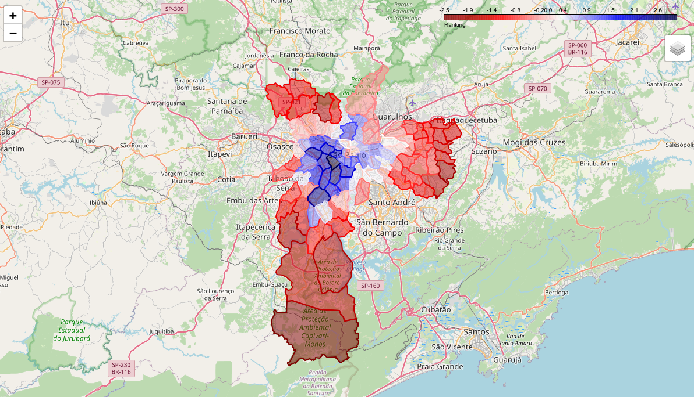

# Ranking Socioeconômico dos Distritos de São Paulo com PCA

  
*Visualização do ranking.*

## Visão Geral

Este projeto utiliza **Análise de Componentes Principais (PCA)** para reduzir a dimensionalidade de dados socioeconômicos dos distritos de São Paulo, criando um ranking baseado em fatores principais. Os resultados são apresentados em uma aplicação interativa construída com **Streamlit**, que inclui mapas dinâmicos, filtros de distritos e exportação de dados, oferecendo uma análise espacial acessível e visualmente impactante. Demonstra competências em Machine Learning, manipulação de dados, visualização geoespacial e desenvolvimento de interfaces.

- **Autor:** Wellington M Santos  
- **Data:** Março 2025  
- **Repositório:** [https://github.com/esscova/ranking-socioeconomico-sp](https://github.com/esscova/ranking-socioeconomico-sp)

## Objetivos

1. Reduzir variáveis socioeconômicas correlacionadas em componentes principais usando PCA.
2. Validar a adequação dos dados com testes estatísticos (KMO e Bartlett).
3. Gerar um ranking ponderado dos distritos com base nos fatores extraídos.
4. Criar uma interface interativa para explorar os resultados em mapas e tabelas.

## Tecnologias Utilizadas

- **Python 3.x**
- **Bibliotecas:**
  - `pandas` e `numpy`: Manipulação e análise de dados.
  - `scikit-learn`: Implementação do PCA e padronização.
  - `factor_analyzer`: Testes de adequação (KMO e Bartlett).
  - `geopandas`: Manipulação de dados geoespaciais.
  - `folium` e `mapclassify`: Visualização de mapas dinâmicos.
  - `plotly` e `matplotlib`: Gráficos interativos e estáticos.
  - `streamlit`: Interface web interativa.

## Estrutura do Projeto
- **`assets`**/
   - Arquivos estáticos.
- **`data/`**
  - `distritos_sp.csv`: Dataset com variáveis socioeconômicas.
  - `SIRGAS_SHP_distrito.shp`: Shapefile dos limites geográficos (fonte: [GeoSampa](http://geosampa.prefeitura.sp.gov.br/)).
  - `dados_completos.geojson`: Dados processados para o app Streamlit.
- **`notebooks/`**
   - **`notebook.ipynb`**: Código detalhado com análise e visualizações.
- **`app.py`**: Aplicação Streamlit para interação com o ranking.
- **`requirements.txt`**: Lista de dependências.

### Fluxo do Projeto

1. **Análise Exploratória:** Carregamento e validação dos dados no notebook.
2. **PCA:** Padronização, extração de fatores e cálculo do ranking.
3. **Aplicação Interativa:** Interface Streamlit com mapa, tabela e filtros.

## Resultados

- **Redução de Dimensionalidade:** Dois fatores (F1 e F2) explicam ~68% da variância, selecionados pelo Critério de Kaiser.
- **Ranking:** Distritos ordenados por scores fatoriais ponderados.
- **Interface:** Aplicação Streamlit com:
  - Mapa interativo filtrável por distritos.
  - Tabela dos top 10 distritos.
  - Exportação do ranking como CSV.

## Como Executar

### Pré-requisitos
- Python 3.8+ instalado.
- Ambiente virtual (ex.: `venv` ou `conda`).

### Instalação
1. Clone o repositório:
   ```bash
   git clone https://github.com/esscova/ranking-socioeconomico-sp
   cd ranking-socioeconomico-sp
   ```
2. Instale as dependências:
   ```bash
   pip install -r requirements.txt
   ```
   *Conteúdo de `requirements.txt`:*
   ```
   pandas
   numpy
   scikit-learn
   factor-analyzer
   geopandas
   folium
   mapclassify
   plotly
   matplotlib
   streamlit
   streamlit-folium
   unidecode
   ```

3. Prepare os dados:
   - Execute o `notebook.ipynb` para gerar `dados_completos.geojson` atualizados, ou pule para a execução da interface web.

### Execução
1. Explore a análise completa:
   ```bash
   jupyter notebook notebook.ipynb
   ```
2. Inicie a aplicação Streamlit:
   ```bash
   streamlit run app.py
   ```
   - Acesse em `http://localhost:8501` no navegador.

## Destaques Técnicos

- **Validação Estatística:** Testes KMO e Bartlett garantem a robustez do PCA.
- **Interatividade:** Streamlit oferece filtros de distritos e exportação de dados.
- **Geoespacialização:** Mapas dinâmicos com Folium integrados em uma interface web.
- **Código Modular:** Estrutura clara para fácil adaptação a outros datasets.


## Contato

- **E-mail:** wsantos08@hotmail.com  
- **LinkedIn:** [linkedin.com/in/wellington-moreira-santos](https://www.linkedin.com/in/wellington-moreira-santos/)